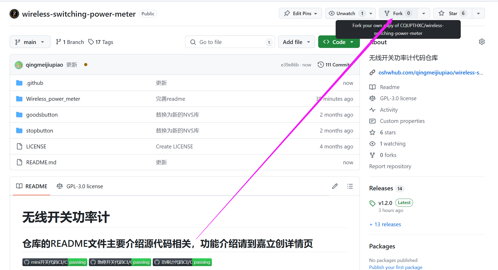
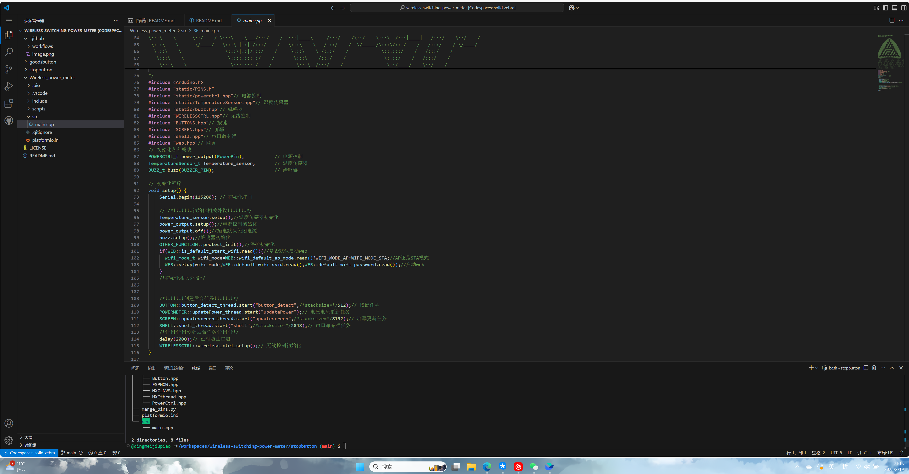
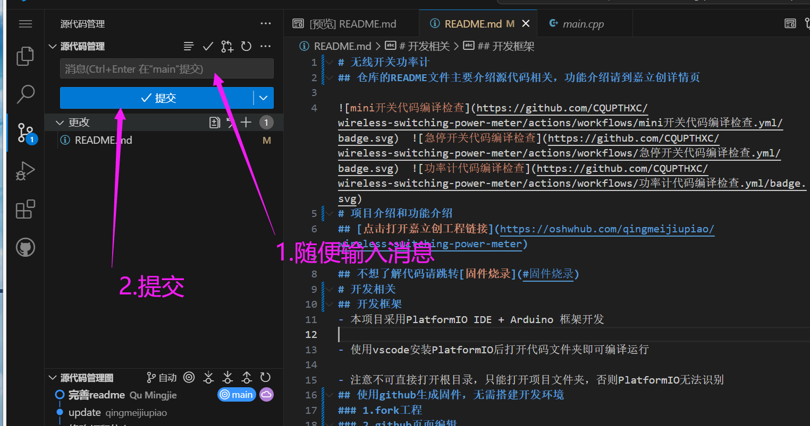
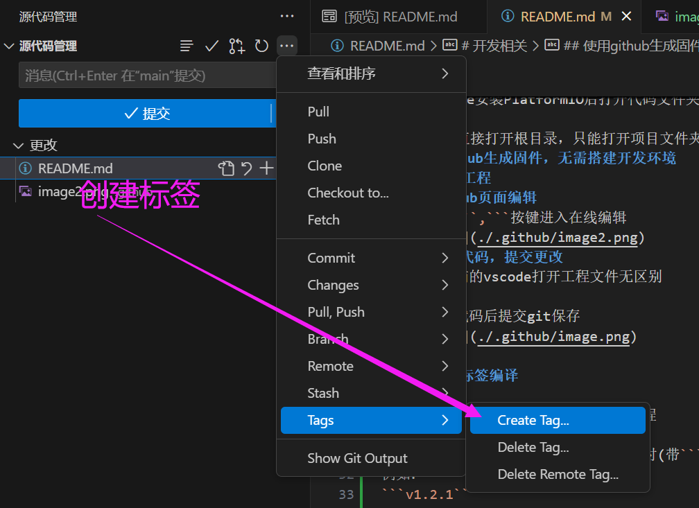
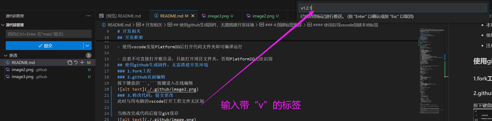
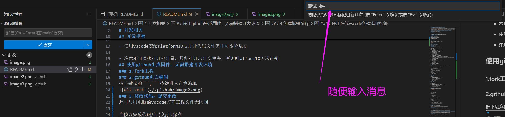
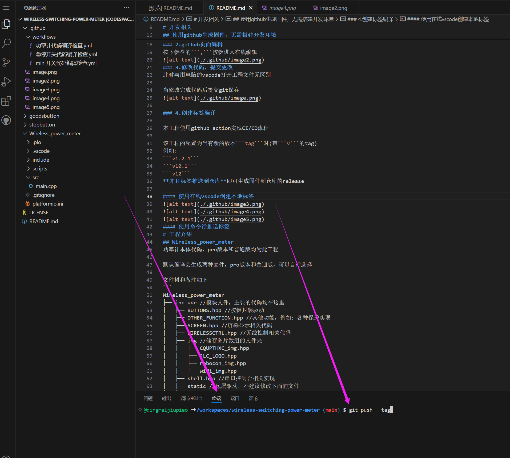
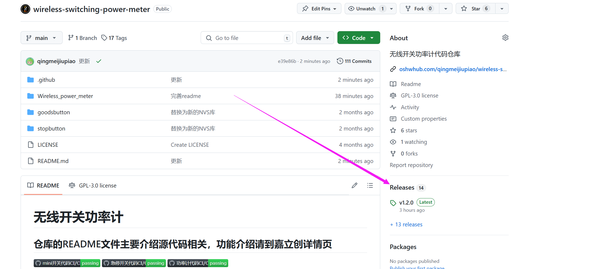

# 无线开关功率计
## 仓库的README文件主要介绍源代码相关，功能介绍请到嘉立创详情页

    
# 项目介绍和功能介绍
## [点击打开嘉立创工程链接](https://oshwhub.com/qingmeijiupiao/wireless-switching-power-meter)

## 不想了解代码请跳转[固件烧录](#固件烧录)
# 开发相关
## 开发框架
- 本项目采用PlatformIO IDE + Arduino 框架开发

- 使用vscode安装PlatformIO后打开代码文件夹即可编译运行

- 注意不可直接打开根目录，只能打开项目文件夹，否则PlatformIO无法识别
## 使用github生成固件，无需搭建开发环境
### 1.fork工程

### 2.github页面编辑 

**在自己fork的工程页面下，按下键盘的```,```按键进入在线编辑**



### 3.修改代码，提交更改
此时与用电脑的vscode打开工程文件无区别

当修改完成代码后提交git保存


### 4.创建标签编译

本工程使用github action实现CI/CD流程

该工程的配置为当有新的版本```tag```时

**并且标签推送到仓库**即可生成固件到仓库的release

#### 使用在线vscode创建本地标签



#### 使用命令行推送标签
创建本地标签后点击命令行输入
```git push --tag```

回车后过几分钟固件即可自动上传到release处


### 5.按照[固件烧录](#固件烧录)处教程烧录固件
# 工程介绍
## Wireless_power_meter
功率计本体代码，pro版本和普通版均为此工程

默认编译会生成两种固件，pro版本和普通版，可以自行选择

文件树和备注如下
```
Wireless_power_meter
├── include //模块文件，主要的代码均在这里
│   ├── BUTTONS.hpp //按键封装驱动
│   ├── OTHER_FUNCTION.hpp //其他功能，例如：各种保护实现
│   ├── SCREEN.hpp //屏幕显示相关代码
│   ├── WIRELESSCTRL.hpp //无线控制相关代码
│   ├── img //储存图片数组的文件夹
│   │   ├── CQUPTHXC_img.hpp
│   │   ├── JLC_LOGO.hpp
│   │   ├── robocon_img.hpp
│   │   └── wifi_img.hpp
│   ├── shell.hpp //串口控制台相关实现
│   ├── static //底层驱动，不建议修改下面的文件
│   │   ├── ESPNOW.hpp //ESPNOW封装库
│   │   ├── FixedSizeQueue.hpp //定长队列封装库
│   │   ├── HXC_NVS.hpp //NVS存储封装库，用于断电数据保存
│   │   ├── HXCthread.hpp //对FreeRTOS的二次封装库，实现类似std::thread的功能
│   │   ├── PINS.h //按键宏定义
│   │   ├── POWERMETER.hpp //电流电压数据读取的封装，PRO版本和普通版本代码唯一的区别在这个文件，由宏定义控制
│   │   ├── SimpleSerialShell.hpp //串口控制台底层驱动
│   │   ├── TemperatureSensor.hpp //温度读取驱动
│   │   ├── buzz.hpp //蜂鸣器驱动
│   │   └── powerctrl.hpp //输出控制驱动
│   ├── web //网页前端相关
│   │   ├── c_header //网页前端数组，由脚本自动生成不可自行修改
│   │   │   └── index_html.h
│   │   └── src //网页前端源文件
│   │       └── index.html
│   └── web.hpp //网页后端和WIFI驱动
├── platformio.ini //工程配置文件
├── scripts //工程脚本
│   ├── embed_files.py //前端数组生成脚本
│   └── merge_bins.py //固件生成脚本
└── src
    └── main.cpp //主函数
```
**注意**

PIO默认上传是PRO版本，如果想要普通版，需要在platformio.ini中注释另外一个版本的环境配置

如下为注释PRO版本的环境,此时仅编译上传普通版本固件
```
;;PRO版本
;[env:Wireless_power_meter_pro]
;extends = common
;build_flags = ${common.build_flags} -D IS_PRO_VERSION=1
;lib_deps = 
;	${common.lib_deps}
;	adafruit/Adafruit INA228 Library@^1.1.0

;普通版本
[env:Wireless_power_meter]
extends = common
build_flags = ${common.build_flags}
lib_deps = 
	${common.lib_deps}
	robtillaart/INA226@^0.5.3

```
## mini开关代码
文件树和备注如下
```
goodsbutton
├── include
│   ├── ESPNOW.hpp //ESPNOW封装库
│   ├── HXC_NVS.hpp //NVS存储封装库，用于断电数据保存
│   ├── PowerCtrl.hpp //功率计输出控制封装
│   └── README
├── merge_bins.py //固件生成脚本
├── platformio.ini //工程配置文件
└── src
    └── main.cpp //主函数
```
## 急停开关代码
文件树和备注如下
```
stopbutton
├── include
│   ├── Button.hpp
│   ├── ESPNOW.hpp //ESPNOW封装库
│   ├── HXC_NVS.hpp //NVS存储封装库，用于断电数据保存
│   ├── HXCthread.hpp //对FreeRTOS的二次封装库，实现类似std::thread的功能
│   └── PowerCtrl.hpp //功率计输出控制封装
├── merge_bins.py //固件生成脚本
├── platformio.ini //工程配置文件
└── src
    └── main.cpp //主函数
```
## 二次开发封装库
如下文件可集成到任意型号的ESP32 arduino框架工程中

- ```ESPNOW.hpp```
- ```PowerCtrl.hpp```
文件目录：./goodsbutton/include/

示例：
```
#include <Arduino.h>
#include "PowerCtrl.hpp"

void setup(){
    //初始化串口
    Serial.begin(115200);

    //初始化
    PowerCtrl::setup();

    //主动配对
    //PowerCtrl::send_pair_package();

    //让功率计以50HZ的频率回传数据
    //PowerCtrl::ctrl_send_data(true,50);
}

void loop(){
    PowerCtrl::power_on();//开启功率计输出
    delay(1000);
    PowerCtrl::power_off();//关闭功率计输出
    delay(1000);
    
    //打印回传的数据，需要先开启数据回传并且是配对的设备
    //Serial.print(PowerCtrl::power_data.voltage);
    //Serial.print(",");
    //Serial.println(PowerCtrl::power_data.current);
}
```

# 固件烧录
如果不想搭建开发环境也可以选择直接烧录固件

[esp下载工具链接](https://www.espressif.com/zh-hans/support/download/other-tools)

## 下载解压后打开工具


## 选择 ESP32-C3和USB烧录


## 点击三个小点选择在[github release](https://github.com/CQUPTHXC/wireless-switching-power-meter/releases)处下载的.bin文件
- 注意区分普通版本和PRO版本固件


## 之后如图设置烧录
烧录前需要先将esp32进入烧录模式，即：按住boot按钮再让芯片启动，电脑能够显示端口就算成功


